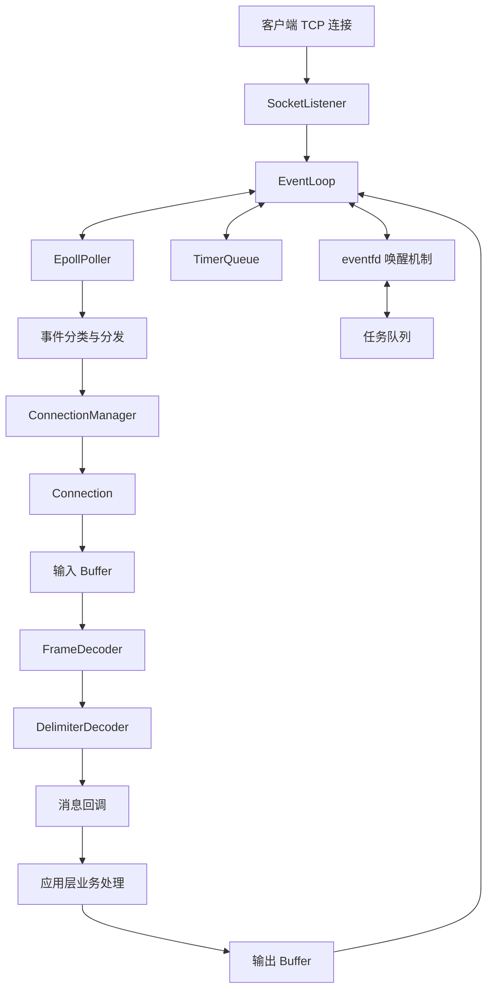

# Evolving C++ Network Library

一个基于 C++ 和 Linux 的事件驱动网络库实践项目，以 Linux Socket、`epoll` 和 Reactor 模型为核心，逐步完善网络 I/O、连接管理、缓冲区、协议解码、定时任务及稳定性测试。

---

## 一、项目亮点

- **Reactor 事件驱动模型：** 使用 Linux `epoll` 进行 I/O 多路复用，通过 `EventLoop` 统一分发网络事件。
- **模块化网络架构：** 将监听 Socket、事件轮询、连接管理、缓冲区和协议解码等职责拆分，降低模块间耦合。
- **TCP 数据流处理：** 通过 `Buffer` 与 `FrameDecoder` 分离数据存储和协议边界识别，支持基于分隔符的消息解码。
- **连接生命周期管理：** 处理连接建立、关闭、I/O 错误、半关闭和空闲连接超时等场景。
- **事件循环任务调度：** 使用 `eventfd` 和任务队列支持事件循环唤醒与任务投递。
- **稳定性测试：** 使用自动化测试覆盖核心模块和关键连接场景，并通过 GitHub Actions 执行持续集成。
- **性能测试：** 使用 `wrk` 对 HTTP 示例服务进行阶梯并发和持续运行测试，统计吞吐量与延迟指标。

## 二、技术栈

| 技术 | 应用场景 |
|---|---|
| C++ | 网络库核心实现 |
| Linux Socket API | TCP 网络通信 |
| `epoll` | I/O 多路复用 |
| Reactor | 事件驱动处理模型 |
| `eventfd` | 事件循环唤醒 |
| `std::thread`、`std::mutex` | 线程与任务队列同步 |
| Buffer | 网络数据缓冲 |
| FrameDecoder | 消息帧解码抽象 |
| TimerQueue | 定时任务与空闲连接检查 |
| CMake | 工程构建 |
| GoogleTest / 项目测试程序 | 自动化测试 |
| GitHub Actions | 持续集成 |
| wrk | HTTP 压力测试 |

---

## 三、架构设计

### 3.1 整体架构

项目采用基于 `epoll` 的 Reactor 事件驱动架构，将网络事件检测、连接管理、数据缓冲、协议解码与业务处理进行分层。



图中展示的是主要模块之间的逻辑关系。当前版本采用单个 `EventLoop` 处理网络事件，并提供任务投递与唤醒接口，不代表已经实现多 EventLoop 线程池或主从 Reactor 架构。

### 3.2 核心模块职责

| 模块 | 核心职责 | 设计目的 |
|---|---|---|
| `SocketListener` | 封装监听 Socket 和接受客户端连接 | 隔离底层 Socket 操作 |
| `EpollPoller` | 管理文件描述符注册、修改、删除和就绪事件等待 | 统一封装 I/O 多路复用 |
| `EventLoop` | 运行事件循环并分发读、写、连接、定时器和唤醒事件 | 集中管理事件处理流程 |
| `Connection` | 封装单个连接的数据读写、缓冲区和相关状态 | 集中管理连接通信逻辑 |
| `ConnectionManager` | 根据文件描述符创建、查找和删除连接 | 统一管理连接对象生命周期 |
| `Buffer` | 保存网络数据并维护可读数据的位置 | 分离网络 I/O 与数据消费 |
| `FrameDecoder` | 定义统一的消息解码接口 | 分离网络数据接收与协议解析 |
| `DelimiterDecoder` | 根据指定分隔符识别完整消息 | 处理 TCP 字节流的消息边界识别 |
| `TimerQueue` | 管理定时任务并通过定时器文件描述符触发处理 | 支持定时任务和空闲连接检查 |
| `eventfd` 与任务队列 | 唤醒事件循环并执行排队任务 | 支持跨线程任务投递 |

### 3.3 Reactor 事件处理流程

服务器启动后，`EventLoop` 将监听 Socket、`eventfd` 和定时器文件描述符注册到 `EpollPoller`，随后通过 `epoll_wait()` 等待就绪事件。

**新连接建立流程：**

1. `epoll` 检测到监听 Socket 就绪。
2. `EventLoop` 调用 `SocketListener` 接受客户端连接。
3. `ConnectionManager` 创建并登记 `Connection` 对象。
4. 为连接设置解码器、消息回调和写事件相关回调。
5. 后续连接读写由事件循环统一驱动。

**数据接收与处理流程：**

1. `epoll` 通知连接可读。
2. `Connection` 接收数据并写入输入缓冲区。
3. 解码器尝试提取完整消息。
4. 完整消息交给消息回调进行业务处理。
5. 业务响应写入输出缓冲区。
6. 如果数据未能一次性发送完毕，则根据发送状态调整可写事件监听。
7. 待发送数据清空后，关闭不再需要的可写事件监听。

这种模型利用 I/O 就绪事件驱动网络处理，避免采用每个连接各自进行阻塞式读写的简单模型。

### 3.4 Buffer 与协议解码设计

TCP 提供的是连续字节流，而不是天然具有业务消息边界的数据包。一次 `recv()` 可能只接收到半条消息，也可能同时接收到多条消息的数据。

因此，项目将缓冲区管理和协议解码分离：

- **Buffer：** 负责数据存储、可读数据管理和已消费数据位置维护。
- **FrameDecoder：** 提供统一的解码接口，定义从缓冲区中提取完整消息的方式。
- **DelimiterDecoder：** 根据指定分隔符识别完整消息，未形成完整消息的数据留待后续接收。

该设计降低了网络 I/O 层与具体消息格式之间的耦合，便于后续扩展其他解码策略。

### 3.5 连接生命周期管理

网络库不仅需要处理正常的数据读写，还需要正确处理连接关闭和异常场景。

当前实现重点覆盖：

- 新连接建立后的对象创建与登记。
- 连接关闭或发生 I/O 错误后的连接清理。
- 对端半关闭发送方向后，继续处理剩余数据并发送已准备好的响应。
- 半关闭连接的待发送数据清空后再进行清理。
- 定期检查连接的最后活跃时间，清理超时空闲连接。
- 删除连接后检查对象是否仍然存在，避免继续访问失效的连接对象。

这些处理有助于减少异常连接遗留、生命周期管理错误和资源清理问题。

---

## 四、核心功能与工程实现

### 4.1 非阻塞 I/O 与 epoll 事件驱动

使用 `epoll` 管理监听 Socket 和客户端连接的 I/O 事件，将事件等待与业务处理分离。

主要价值：

- 通过 I/O 多路复用统一管理多个连接。
- 根据就绪事件处理读写操作。
- 将事件分发逻辑集中在 `EventLoop`。
- 为后续扩展连接管理与多线程事件循环提供基础。

### 4.2 输入输出缓冲区管理

连接对象通过缓冲区管理接收数据与待发送数据。

主要价值：

- 避免业务处理直接依赖单次 `recv()` 的数据长度。
- 支持不完整消息暂存和后续数据拼接。
- 维护已消费数据位置，减少不必要的数据搬移。
- 支持待发送数据暂存及后续写事件驱动发送。

### 4.3 可扩展的消息解码接口

通过 `FrameDecoder` 抽象解码行为，并实现 `DelimiterDecoder` 作为分隔符解码器。

主要价值：

- 将 TCP 字节流与应用层消息边界识别分离。
- 支持消息不完整时保留数据。
- 降低新增消息格式对事件循环和连接管理代码的影响。

### 4.4 定时任务与空闲连接清理

通过 `TimerQueue` 管理定时任务，并结合定时器文件描述符接入事件循环。

当前空闲连接检查会周期性检查连接最后活跃时间，并清理超过设定阈值的连接。

### 4.5 事件循环唤醒与任务投递

使用 `eventfd` 配合任务队列，为事件循环提供唤醒和任务投递机制。

主要价值：

- 支持将任务投递到事件循环执行。
- 在线程需要向事件循环提交任务时，可以通过唤醒机制通知循环。
- 为后续完善跨线程调度和多 EventLoop 架构提供基础。

### 4.6 自动化测试与持续集成

通过项目测试程序和 GitHub Actions 验证关键模块与连接场景。

重点关注：

- Buffer 基本行为。
- 解码器消息边界处理。
- ConnectionManager 连接管理。
- EventLoop 事件处理。
- 半关闭连接的响应行为。
- 工程构建和自动化测试流程。

持续集成用于尽早发现编译、测试和工作流配置问题，减少后续迭代对已有功能的影响。

---

## 五、关键问题与优化

### 5.1 Buffer 数据消费与内存增长

**问题：** 在连续处理数据的过程中，如果缓冲区只追加数据而不能合理回收已消费部分，可能导致内存持续增长，影响长时间运行的稳定性。

**优化方向与实现：**

- 使用读取位置标记管理已经消费的数据。
- 让缓冲区能够区分已消费数据和仍然可读的数据。
- 在适当时机整理缓冲区，减少无效数据长期占用空间。
- 在没有剩余有效数据时重置读取状态。

**验证：** 项目迭代期间，针对 16 KB 消息的压力测试曾出现内存持续增长并触发 OOM 的问题。调整缓冲区消费与整理逻辑后，完成了 100,000 次请求的回归验证，未再次观察到此前相同的 OOM 现象。

该结果说明此次回归测试没有复现原问题，不等同于已经证明所有场景下都不存在内存泄漏。

### 5.2 半关闭连接处理

**问题：** TCP 允许一端关闭发送方向，但仍然接收对端的数据。服务端如果将对端发送方向关闭直接等同于整个连接必须立即销毁，可能导致已接收请求的响应无法正常返回。

**处理方式：**

- 识别对端关闭发送方向的状态。
- 在连接仍有待发送响应时继续完成写操作。
- 在响应数据发送完成后再清理连接。

**验证：** 增加半关闭回归测试，客户端发送 HTTP GET 请求后执行 `shutdown(sockfd, SHUT_WR)`，随后继续读取服务端响应。测试验证了服务端能够返回 HTTP 200 响应及 `hello,world` 消息内容。

### 5.3 连接生命周期安全

**问题：** 事件处理过程中可能出现连接被删除后，后续逻辑仍尝试访问原连接对象的风险。

**处理方式：**

- 连接清理后及时结束当前事件处理分支。
- 在处理事件前检查连接对象是否仍然存在。
- 避免在连接生命周期结束后继续访问相关对象。

这类防护有助于降低连接关闭与事件处理交错时的生命周期错误风险。

---

## 六、性能测试

项目使用 `wrk` 对 HTTP 示例服务进行压力测试，采用阶梯并发测试与持续运行测试相结合的方式，观察吞吐量和请求延迟随并发连接数变化的趋势。


### 6.1 测试环境与方法

| 项目 | 配置 |
|---|---|
| 测试工具 | wrk |
| 测试地址 | `http://127.0.0.1:8080/` |
| wrk 线程数 | 4 |
| 预热时间 | 60 秒 |
| 阶梯测试 | 每档 30 秒 |
| 稳定性测试 | 300 秒 |
| 测试方式 | 本机客户端与服务端进行 HTTP 请求压测 |

客户端和服务端运行在同一台机器上，因此结果反映的是当前本机测试环境下的端到端表现，而不是独立网络环境中的纯服务端性能。

### 6.2 阶梯并发测试结果

| 并发连接数 | 吞吐量（req/s） | 平均延迟 | P99 延迟 |
|---:|---:|---:|---:|
| 100 | 163,440 | 0.89 ms | 5.16 ms |
| 200 | 332,141 | 1.02 ms | 5.93 ms |
| 400 | 339,715 | 1.28 ms | 5.97 ms |
| 600 | 335,011 | 1.71 ms | 6.50 ms |
| 1,000 | 298,820 | 2.90 ms | 8.98 ms |
| 2,000 | 253,663 | 5.07 ms | 11.22 ms |
| 5,000 | 216,475 | 12.88 ms | 32.41 ms |
| 10,000 | 192,176 | 28.37 ms | 75.37 ms |
| 20,000 | 124,720 | 57.18 ms | 142.04 ms |


### 6.3 阶梯测试观察

在本次测试中：

- 400 并发连接时获得本轮最高吞吐量，约 **339,715 req/s**。
- 在 100 至 600 并发连接范围内，吞吐量保持在较高水平。
- 随着并发连接数增加，平均延迟和 P99 延迟整体上升。
- 20,000 并发连接时，吞吐量下降至约 124,720 req/s，P99 延迟上升至约 142.04 ms。

这些结果表明，在当前测试配置下，增加并发连接数并不一定持续提高吞吐量。进一步分析还需要结合 CPU、内存、文件描述符使用情况以及客户端资源占用。

### 6.4 300 秒稳定性测试

在 400 并发连接配置下进行 300 秒持续测试，结果如下：

| 指标 | 测试结果 |
|---|---:|
| 测试时长 | 300 秒 |
| 总请求数 | 103,095,084 |
| 平均吞吐量 | 343,606 req/s |
| 平均延迟 | 1.29 ms |
| P99 延迟 | 5.90 ms |

在本次持续测试中，服务保持了较高的请求处理吞吐量，延迟指标也与阶梯测试中 400 并发连接时的结果接近。

该测试为当前配置下的短期稳定性提供了依据，但不能单凭一次测试证明不存在内存泄漏或其他长期运行问题。

### 6.5 高并发连接测试的限制

在 30,000 并发连接测试档位中，报告记录了 1,771 次连接错误，测试阶梯因此停止。

这说明在当前测试环境与配置下，该档位出现了连接建立问题。由于客户端资源、操作系统文件描述符限制及服务端处理能力都可能影响结果，不能仅凭这一现象认定网络库的最大连接数为 30,000，也不能直接将错误归因于某一个模块。

后续可以通过重复测试、检查系统资源限制以及分别监控客户端和服务端，进一步定位原因。

### 6.6 性能测试结论

本次测试主要验证了以下内容：

1. HTTP 示例服务能够承受较高的持续请求吞吐量。
2. 并发连接数会影响吞吐量和尾延迟，存在需要结合实际环境分析的性能拐点。
3. 300 秒持续压测能够用于观察指定配置下的运行表现。
4. 高并发连接建立失败需要结合操作系统和客户端资源进行进一步排查。

当前测试未记录完整的硬件配置、CPU 使用率和内存曲线，因此不对 CPU 效率、内存占用上限或最大并发能力作未经验证的结论。

---

## 七、编译与运行

### 7.1 环境要求

- Linux
- 支持 C++ 项目所需语言特性的编译器
- CMake
- 项目所需的测试和运行依赖

### 7.2 编译项目

在项目根目录执行：

```bash
cmake -S . -B build -DCMAKE_BUILD_TYPE=Release
cmake --build build -j"$(nproc)"
```

### 7.3 启动服务

```bash
./build/main --port 8080 --threads 4
```

具体参数以当前项目的 `main` 程序和配置实现为准。

### 7.4 验证 HTTP 响应

另开一个终端执行：

```bash
curl -i http://127.0.0.1:8080/
```

当前 HTTP 示例服务用于演示网络库的连接处理和请求响应流程，并不实现完整的 HTTP 协议栈。

---

## 八、性能测试复现

项目已经包含压力测试脚本，可以直接使用现有脚本复现测试，无需额外创建一套测试程序。

确保服务已按脚本要求启动，并安装 `wrk` 后，在项目根目录执行：

```bash
chmod +x scripts/benchmark.sh
./scripts/benchmark.sh
```

测试结束后，检查 `results/` 目录下生成的报告。

建议在正式记录新的性能数据前：

- 确认客户端和服务端均没有其他高负载任务。
- 保存测试机器的 CPU、内存、操作系统及文件描述符限制信息。
- 对吞吐量峰值附近的并发档位重复测试。
- 记录连接错误、读写错误和超时情况。
- 区分客户端资源瓶颈与服务端处理瓶颈。

---

## 九、项目结构

```text
Evolving_Cpp_Network_Library/
├── include/
│   ├── Buffer.h
│   ├── Connection.h
│   ├── ConnectionManager.h
│   ├── EpollPoller.h
│   ├── Event.h
│   ├── EventLoop.h
│   ├── SocketListener.h
│   ├── TimerQueue.h
│   └── decoder/
│       ├── FrameDecoder.h
│       ├── Decoder.h
│       └── DelimiterDecoder.h
├── src/
│   ├── Buffer.cpp
│   ├── Connection.cpp
│   ├── ConnectionManager.cpp
│   ├── EpollPoller.cpp
│   ├── EventLoop.cpp
│   ├── SocketListener.cpp
│   ├── TimerQueue.cpp
│   └── decoder/
├── test/
├── benchmark/
├── scripts/
│   └── benchmark.sh
├── results/
├── .github/
│   └── workflows/
├── CMakeLists.txt
└── README.md
```

以上为主要模块的示意结构，实际文件以仓库当前目录为准。

---

## 十、后续优化方向

当前项目已经覆盖网络库核心模块和部分稳定性、性能验证工作。后续可沿以下方向继续迭代：

- **多线程 I/O 架构：** 完善多 EventLoop 设计、连接分配与跨线程任务调度。
- **稳定性：** 补充异常连接、并发关闭、错误恢复及长时间运行测试。
- **性能分析：** 引入 CPU、内存、文件描述符等资源监控，分析吞吐量和尾延迟变化。
- **协议扩展：** 增加长度字段解码器、固定长度解码器等实现。
- **内存优化：** 结合性能分析结果评估内存池、对象复用等方案是否值得引入。
- **工程质量：** 持续完善自动化测试、CI 和构建配置。

以上为后续计划，不代表这些能力均已在当前版本实现。

---

## 十一、总结

本项目围绕 Linux C++ 网络编程，逐步构建了以 `epoll` 和 `EventLoop` 为核心的事件驱动网络处理结构，并通过连接管理、缓冲区、协议解码、定时任务和任务投递机制完善网络库的基础能力。

在实现功能的同时，项目针对缓冲区内存增长、TCP 半关闭和连接生命周期等问题进行了迭代，并通过自动化测试、GitHub Actions 和 `wrk` 压力测试验证关键行为。

项目的核心价值不仅在于实现网络通信，还在于围绕实际问题进行模块设计、定位缺陷、验证修复效果，并通过可复现的测试数据观察性能变化。
